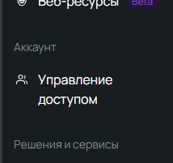

# **Питомцы-бот (Pets Bot)**

**Pets Bot** — это Telegram-бот, предназначенный для управления отчетами и информацией, связанной с приютами для животных. Бот позволяет усыновителям, волонтерам и сотрудникам приюта обмениваться информацией, отправлять отчеты и получать консультации по уходу за животными.

## **Основной функционал**
1. **Информация о приюте**: Бот предоставляет важную информацию о приюте, включая контактные данные охраны, рекомендации по безопасности, расписание работы и адрес приюта.

2. **Отчеты о животных**: Пользователи могут отправлять отчеты о состоянии животных, включая информацию о питомце и фотографию. Отчеты сохраняются в системе и могут быть просмотрены позже.

3. **Консультации по уходу за животными**: Бот предоставляет рекомендации по уходу за животными, включая советы по транспорту животных, уходу за щенками и взрослыми питомцами.

4. **Контакты с волонтерами**: Бот позволяет пользователям связываться с волонтерами для получения помощи или дополнительной информации о животных.

## **Как запустить**

1. **Создайте бота в [BotFather](https://t.me/BotFather)** для получения токена и имени бота.

2. **Зарегистрируйтесь на [Selectel](https://selectel.ru/)**, создайте аккаунт и получите доступ к облачным сервисам.

3. **Создайте хранилище в Selectel**:
    - Перейдите на вкладку "Объектное хранилище" и создайте новый контейнер.  
        

4. **Управление доступом**:
    - После создания контейнера перейдите на вкладку "Управление доступом".  
        
    - Создайте сервисного пользователя с ролью "Администратор проекта".

5. **Создание ключей доступа**:
    - Перейдите на вкладку доступа, затем выберите "S3 ключи" и добавьте новый ключ.
    - Сохраните **Secret Key** — он будет нужен для интеграции с проектом.

6. **Создайте базу данных в PostgreSQL**.

7. **Настройка проекта**:
   Перейдите в файл [application.properties](src%2Fmain%2Fresources%2Fapplication.properties) и настройте параметры:
    - В `spring.datasource.url` укажите URL вашей базы данных.
    - В `spring.datasource.username` укажите имя базы данных.
    - В `spring.datasource.password` укажите пароль от базы данных.
    - В `telegram.bot.name` укажите имя бота, которое вы получили в BotFather.
    - В `telegram.bot.token` укажите токен бота, который вы получили в BotFather.
    - В `s3.selectel.accessKey` укажите **Access Key** вашего пользователя в Selectel.
    - В `s3.selectel.secretKey` укажите **Secret Key**, который вы сохранили после создания доступа в Selectel.
    - В `s3.selectel.bucketName` укажите имя вашего контейнера в Selectel.
    - В `s3.selectel.domain` укажите домен вашего контейнера. Для этого перейдите в "Объектное хранилище", выберите ваш контейнер и скопируйте основной домен.  
        
    - В `my.shelter.id` и `my.animals.advice.id` временно установите значение `1`.

8. **Запустите проект** и откройте Swagger UI по адресу [http://localhost:8080/swagger-ui/index.html#](http://localhost:8080/swagger-ui/index.html#).

9. **Отправьте рекомендации по животным**:
    - Найдите `animal-advice-controller` и отправьте POST запрос для получения рекомендаций по животным. Подробнее смотрите в документации API.
    - далее добавите id к `my.animals.advice.id`

10. **Отправьте информацию по приюту**:
- Перейдите к `shelters-info-controller` и отправьте POST запрос для получения информации о приюте. Подробнее смотрите в документации API.
- после добавите id к `my.shelter.id`

## **API**

### В разработке...
